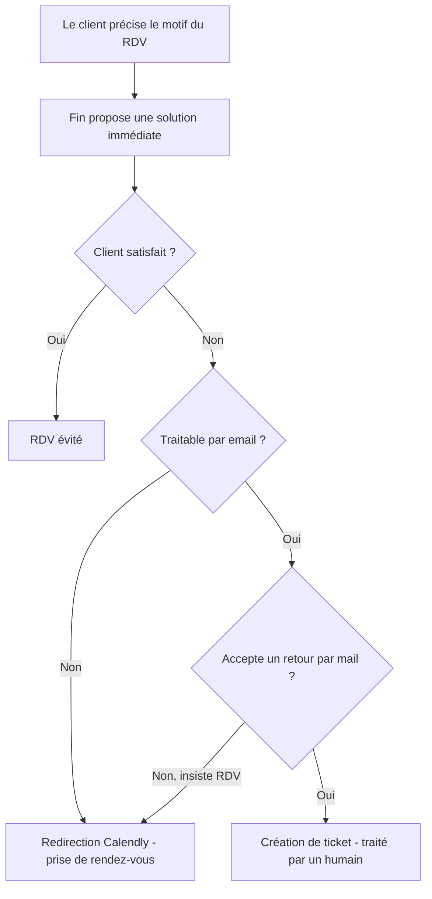

# Cadrage en issues — Améliorations prise de RDV au sein de l'espace client

Projet Linear cible : **Améliorations prise de RDV au sein de l'espace client** · équipe **AI Ops** (à créer).
Source : page Notion du même nom (export HTML) + cinématique fournie.

> Document de cadrage. Contenu en français, factuel, sans tiret cadratin. Structure en 3 dépendances (une par équipe), chacune déclinée en sous-issues. Label `Area > Care` sur les issues.

---

## Description du projet (proposée)

### Summary
Filtrer et qualifier les demandes de RDV de l'espace client via un workflow Intercom (Fin), pour éviter les RDV support évitables et orienter vers le bon canal (résolution immédiate, email asynchrone, ou RDV avec le conseiller attitré).

### Objectif
Rendre la prise de RDV depuis l'espace client plus efficace (moins de RDV support évitables) et plus pertinente. Au clic sur « prendre RDV », un workflow Intercom (Fin) tente de résoudre la demande immédiatement ; selon la nature du sujet et le profil client, il oriente soit vers un traitement asynchrone par email (ticket humain), soit vers la prise de rendez-vous, en priorisant le conseiller attitré.

### Contexte
Aujourd'hui, au clic sur « prendre RDV » (Calendly), aucune tentative proactive de résoudre la demande n'est faite, d'où des RDV inutiles ; le client choisit aussi librement un conseiller au lieu de se voir proposer en priorité son conseiller attitré. La logique « conseiller attitré -> disponibilités » est déjà implémentée côté Tech ; c'est désormais le Messenger Intercom qui doit surfacer le bon lien, donc ce mapping doit être embarqué dans le workflow. Deux propositions issues de la spec Notion : (1) retirer l'option de contact par mail au profit de « Discuter avec nous » (ouvre le Messenger / Fin) ; (2) lancer un flow custom Fin pour la prise de RDV (voir cinématique).

### Périmètre
- Workflow Intercom custom déclenché au clic, avec tentative de résolution par Fin puis branches de sortie (RDV évité / email-ticket / redirection Calendly).
- Intégration dans le workflow des règles métier Care (sujets à traiter par email, forçage par segment) et du mapping conseiller attitré -> URL Calendly.
- Adaptation du menu de l'espace client (Messenger par défaut + déclenchement du workflow ; remplacement de l'option email par « Discuter avec nous »).
- Cinématique documentée (flowchart).

### Hors-scope
- L'implémentation de la logique « conseiller attitré » côté Tech (déjà réalisée) : on ne fait que la consommer dans le workflow.
- Toute refonte plus large de l'espace client.

### Parties prenantes
- **AI Ops (Marvin)** : conception et configuration du workflow Intercom.
- **Care / Ops** : règles métier (sujets email-first, forçage par segment).
- **Tech / Produit** : adaptation du menu de l'espace client ; fournit la logique conseiller attitré déjà en place.

### Design
Besoin de design : à confirmer (léger). Le workflow s'appuie sur le Messenger Intercom natif ; le changement de menu peut nécessiter une retouche.

---

## Cinématique du workflow (à intégrer dans l'issue 1.1)



---

## Découpage en issues

### Dépendance 1 — AI Ops / Marvin : Workflow Intercom de prise de RDV  *(issue parente)*
- **1.1** Concevoir la cinématique du flow (décisions et sorties) — inclut le flowchart ci-dessus.
- **1.2** Construire le workflow custom Fin dans Intercom, déclenché au clic « prendre RDV » (tentative de résolution immédiate).
- **1.3** Implémenter les branches de sortie : RDV évité / traitable email -> ticket humain / insiste ou non traitable -> redirection Calendly.
- **1.4** Intégrer dans les conditions du workflow les règles métier définies par Care (sujets email-first + forçage par segment).
- **1.5** Embarquer le mapping « conseiller attitré -> URL Calendly » (avec backup si pas de disponibilité sous délai raisonnable), en consommant la logique conseiller déjà livrée par Tech.

### Dépendance 2 — Care / Ops : Règles métier de la prise de RDV  *(issue parente)*
- **2.1** Définir les typologies de sujets à privilégier en traitement email asynchrone (et, en miroir, ceux où le RDV est justifié).
- **2.2** Définir la logique de forçage du RDV par segment client (ex. VAP / Tier 1, clients récemment onboardés, souscripteurs d'un produit spécifique ; le cas Tier 3 de la spec Notion est à trancher).

### Dépendance 3 — Tech : Menu de l'espace client  *(issue parente)*
- **3.1** Remplacer l'option « contact par mail » par « Discuter avec nous » (ouvre le Messenger / Fin).
- **3.2** Déclencher le workflow Intercom spécifique (dépendance 1) au clic sur l'entrée de prise de RDV, en ouvrant le Messenger par défaut.

### Dépendances entre lots

```
Dépendance 2 (règles Care) ──> Dépendance 1 (workflow, via 1.4)
Dépendance 1 (workflow) ──────> Dépendance 3.2 (menu déclenche le workflow)
Logique conseiller attitré (Tech, déjà faite) ──> 1.5 (input)
```

Ordre conseillé : Care (2) et cadrage cinématique (1.1) en parallèle, puis construction du workflow (1.2 à 1.5), puis adaptation du menu (3).

---

## Questions ouvertes
1. **Projet Linear** : je le crée dans AI Ops avec ce nom, ou existe-t-il déjà ?
2. **Affectation par équipe** : garder toutes les issues dans AI Ops en indiquant l'équipe porteuse dans le corps (et via assigné/label), ou créer les sous-issues Care et Tech directement dans leurs équipes (nécessite d'ajouter ces équipes au projet) ?
3. **Segments de forçage** : confirmer les segments (VAP/Tier 1, onboardés récents, produit spécifique) vs le « Tier 3 » de la spec Notion.
4. **Design** : besoin de design (Oui/Non) pour le changement de menu ?
